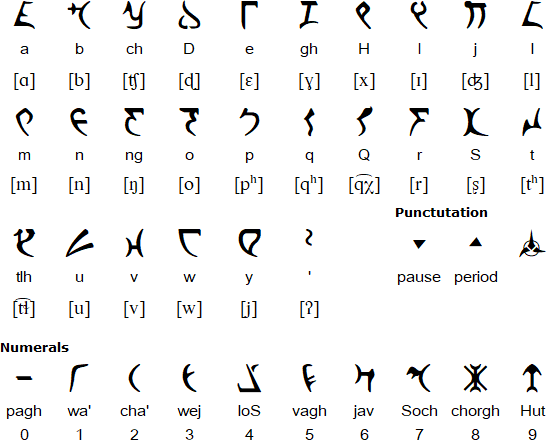

# Klingon keyboard for Mac

## Installation

```sh
git clone https://github.com/raisty/klingon-keyboard.git
cd klingon-keyboard/
sudo cp klingon.bundle /Library/Keyboard\ Layouts/
cd .. && rm -rf klingon-keyboard/
```

## Modifications

Feel free to [fork](https://github.com/raisty/klingon-keyboard/fork) the repository and modify the keyboard layout with [Ukulele](https://software.sil.org/ukelele) software.

## Keyboard types

- Klingon QghaD
- Klingon plqaD simplefied (the similar unicode characters are used)

## Glyphs



> If you found better representing yet-approved Unicode character, please open Issue or raise PR.

## License

[CORE](LICENSE)
